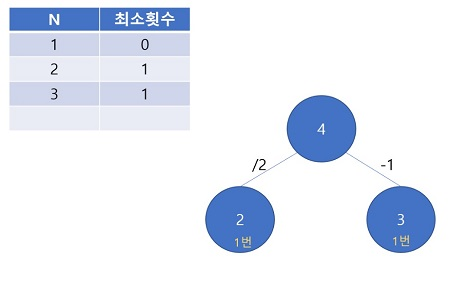
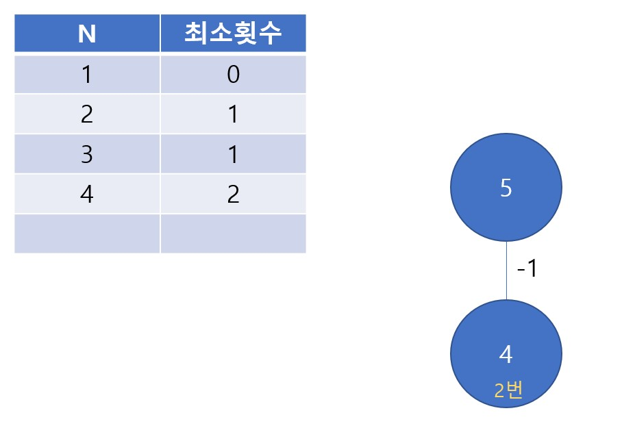
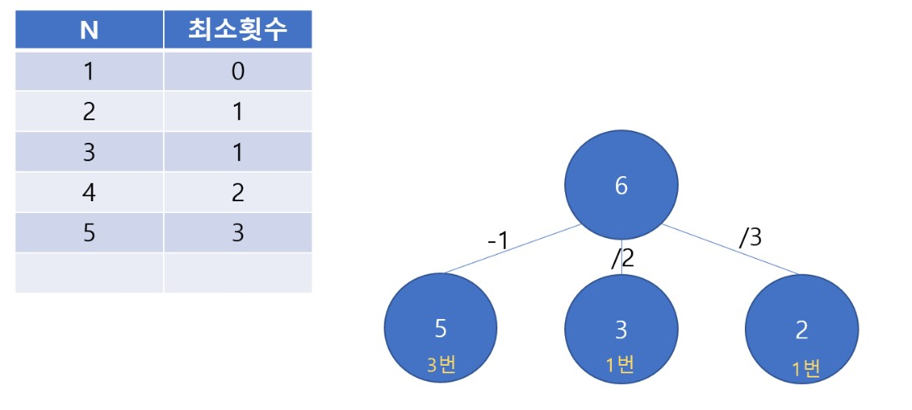

### DP(Dynamic Programming, 다이나믹 프로그래밍)
#### 주어진 문제의 특정 값을 구하기 위해 부분 문제의 정답을 한 번만 계산하여 저장하고, 이를 활용하는 효율적인 알고리즘

    #include <Stdio.h>
    int fibonacci(int n) {
    	if (n == 1 || n == 2) return 1;
    	else return fibonacci(n - 1) + fibonacci(n - 2);
    }

    int main(void) {
	    printf("%d", fibonacci(10));
	    return 0;
    }
    
위의 피보나치 소스코드를 보면, fibonacci(10)을 계산하기 위해서 fibonacci(9)와 fibonacci(8)을 호출한다. 
이것이 반복되면 결국 아래와 같이 계속적인 재귀형태로 fibonacci()를 중복호출(2^n 번)하게 된다.

이때 계산된 값은 배열에 저장하고, 중복 호출 시에 이를 활용하여 빠른 연산을 도울 수 있다.

    #include <Stdio.h>
    int f[100] = { 0, };

    int fibonacci(int n) {
    	if (f[n] != 0) return f[n];
    	else {
	    	if (n == 1 || n == 2) return 1;
    		else return f[n] = fibonacci(n - 1) + fibonacci(n - 2);
    	}
    }

    int main(void) {
    	printf("%d", fibonacci(10));
    	return 0;
    }

#### 예제1) [1로 만들기](https://www.acmicpc.net/problem/1463)
    정수 X에 사용할 수 있는 연산은 다음과 같이 세 가지 이다.
     1. X가 3으로 나누어 떨어지면, 3으로 나눈다.
     2. X가 2로 나누어 떨어지면, 2로 나눈다.
     3. 1을 뺀다.
    정수 N이 주어졌을 때, 위와 같은 연산 세 개를 적절히 사용해서 1을 만들려고 한다. 연산을 사용하는 횟수의 최솟값을 출력하시오.

이 문제는 처음엔 /3 /2 -1 순으로 우선순위를 두고 n이 1보다 작을 때까지 진행하고 연산을 실행할 때, 횟수를 카운트하면 된다고 생각했다.
하지만, 당연히 예외가 있는데 “10”같은 경우다. 10은 2로 나누어지지만, 사실 최소로 연산하려면 -1을 먼저 수행해야 한다.
10->5->4->2->1 ; 최소횟수 4번
10->9->3->1 ; 최소횟수 3번

그러니까 한마디로, 2와 3으로 나누어져도 -1을 수행했을 때와 비교해서, 최소 값을 반환해야 한다는 것이다. 조금 막막하지만 다이나믹 프로그래밍을 생각해보자.
다이나믹 프로그래밍은 분명 이전 결과값을 저장하는 형식이라고 했다. 그래서 어떤 값을 구하려고 할 때, 이전의 값들을 활용해서 효율적인 계산을 돕는다. 이점을 고려해보자면, 아마 1차원 배열에는 각 숫자의 최소 연산횟수가 저장되어 있지 않을까 생각했다.

예를 들어서,
1 : 최소횟수 0번
2 : 최소횟수 1번
3 : 최소횟수 1번

만약에 N이 4라면 -1, 2로 나눴을 때 값이 3혹은 2이다. 최소횟수는 1번으로 같으므로 4의 최소횟수는 2번이 된다.

{: width="50" height="100"}
다음, 만약에 N이 5라면 2나 3으로 나눠지지 않으므로 -1을 하면 4가 나온다. 따라서 4의 최소횟수에 +1을 해주면된다. 따라서 5의 최소횟수는 3번이 된다.

{: width="50" height="100"}
다음, 만약에 N이 6이라면 2나 3으로 나눠진다. -1을 해도 된다. 만약 2로 나누면 3이되고, 3으로 나누면 2가 되고, -1을 하면 5가 된다. 따라서 여기서 2와 3의 최소횟수는 1번이며, 5는 3번이므로, 2와 3의 최소횟수가 더 적다. 따라서 6의 최소횟수는 2번이 된다.

그러면 이 횟수들을 저장할 배열을 DP[]로 하고, N에 대한 최소횟수는 DP[N]안에 넣도록 한다. 그러면 이제 저 위의 아이디어를 어떻게 구현할지 고민해야 한다. 방금 예로 들었던 N=6일때를 보면
1) DP[6] = DP[6-1] + 1 
2) if (6%2 == 0) DP[6] = DP[6/2] + 1
3) if (6%3 == 0) DP[6] = DP[6/3] + 1
이렇게 될 것이고, 1~3번 중에서 DP[6]값이 가장 작은 것이 DP[6]값으로 들어가야 할 것이다.
